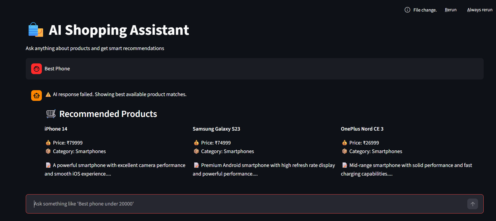

# RAG Based E-commerce AI Assistant

This project implements a Retrieval-Augmented Generation (RAG) based chatbot for e-commerce product recommendations.

## Features
- Intent Detection
- Vector Search (FAISS)
- Price Filtering
- Ranking
- LLM Response (Groq)

## FLOW Architecture
User Query -> Intent Detection -> Retrieval -> Filtering -> Ranking -> LLM Response

## Tech Stack
- Python
- FAISS
- LangChain
- Groq API
- FastAPI

## Setup Instructions

> Create a virtual environment and install dependencies:
- python -m venv venv
- venv\Scripts\activate

> Install required packages:
- pip install -r requirements.txt

> Run the FastAPI server:
- uvicorn app:app --host 127.0.0.1 --port 8000
- streamlit run streamlit_app.py

# OUTPUT IMAGE

